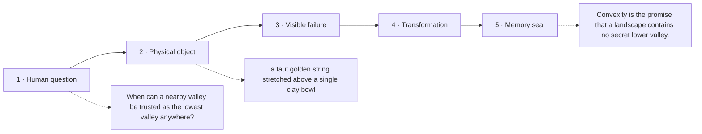

# Diagram — Excavation 224: Convexity — A Landscape Without Hidden Valleys

## The five-frame memory film



```text
FRAME 1 — QUESTION
When can a nearby valley be trusted as the lowest valley anywhere?

FRAME 2 — OBJECT
a taut golden string stretched above a single clay bowl

FRAME 3 — FAILURE
On a rippled floor, the traveler settles in a shallow pocket while a deeper valley hides beyond a ridge.

FRAME 4 — TRANSFORMATION
Stretch the string between any two points. If the landscape always remains below its chord, no hidden ridge can protect a better local valley.

FRAME 5 — SEAL
Convexity is the promise that a landscape contains no secret lower valley.
```

## Position inside the Undercroft

```text
Realm 5 of 5 — The Garden of Futures
sufficient present → remembered futures → trustworthy landscape → safe computation
current root: Convexity
```

```text
temptation : trust any small local minimum as the best possible solution
break      : on a rippled landscape, a nearby valley may be higher than another valley beyond a ridge. Local slope alone cannot certify that no better point exists elsewhere.
repair     : require every chord between two points to lie on or above the function, preventing a hidden hump from separating a local minimum from a lower global one
```

The film can be replayed without the equation. Once it is vivid, the symbols become a compact subtitle for a scene the reader already owns.
