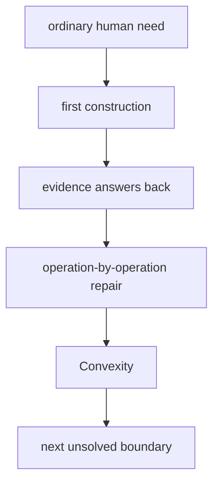

# Diagram — Excavation 224: Convexity — A Landscape Without Hidden Valleys



```text
temptation : trust any small local minimum as the best possible solution
break      : on a rippled landscape, a nearby valley may be higher than another valley beyond a ridge. Local slope alone cannot certify that no better point exists elsewhere.
repair     : require every chord between two points to lie on or above the function, preventing a hidden hump from separating a local minimum from a lower global one
```

The diagram is deliberately causal. Its arrows mean “this failure made the next responsibility necessary,” not merely “read this box next.”
