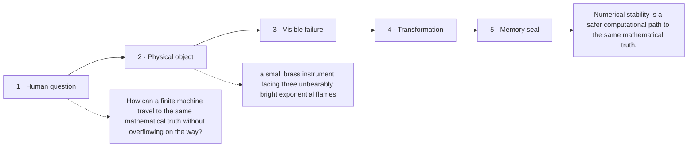

# Diagram — Excavation 225: Numerical Stability — Preserving Mathematics Inside a Finite Machine

## The five-frame memory film



```text
FRAME 1 — QUESTION
How can a finite machine travel to the same mathematical truth without overflowing on the way?

FRAME 2 — OBJECT
a small brass instrument facing three unbearably bright exponential flames

FRAME 3 — FAILURE
The first flame becomes infinity before the machine can compare it with the others; a meaningful ratio collapses into infinity divided by infinity.

FRAME 4 — TRANSFORMATION
Transpose every score by the largest one. The flames shrink into the instrument's range while their relative brightness remains unchanged; restore the removed scale only at the end.

FRAME 5 — SEAL
Numerical stability is a safer computational path to the same mathematical truth.
```

## Position inside the Undercroft

```text
Realm 5 of 5 — The Garden of Futures
sufficient present → remembered futures → trustworthy landscape → safe computation
current root: Numerical Stability
```

```text
temptation : evaluate the written formula literally and assume algebraic equivalence guarantees computational equivalence
break      : finite arithmetic has ceilings, floors, and rounding. Overflow turns meaningful ratios into `∞/∞`; subtracting nearly equal large numbers can discard the very digits carrying their difference.
repair     : rewrite the calculation so intermediate values remain in a safe range while the exact mathematical result stays unchanged
```

The film can be replayed without the equation. Once it is vivid, the symbols become a compact subtitle for a scene the reader already owns.
