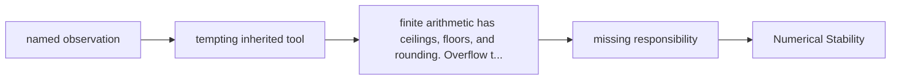

# Diagram — Excavation 225: Numerical Stability — Preserving Mathematics Inside a Finite Machine



```text
temptation : evaluate the written formula literally and assume algebraic equivalence guarantees computational equivalence
break      : finite arithmetic has ceilings, floors, and rounding. Overflow turns meaningful ratios into `∞/∞`; subtracting nearly equal large numbers can discard the very digits carrying their difference.
repair     : rewrite the calculation so intermediate values remain in a safe range while the exact mathematical result stays unchanged
```

The diagram is deliberately causal. Its arrows mean “this failure made the next responsibility necessary,” not merely “read this box next.”
