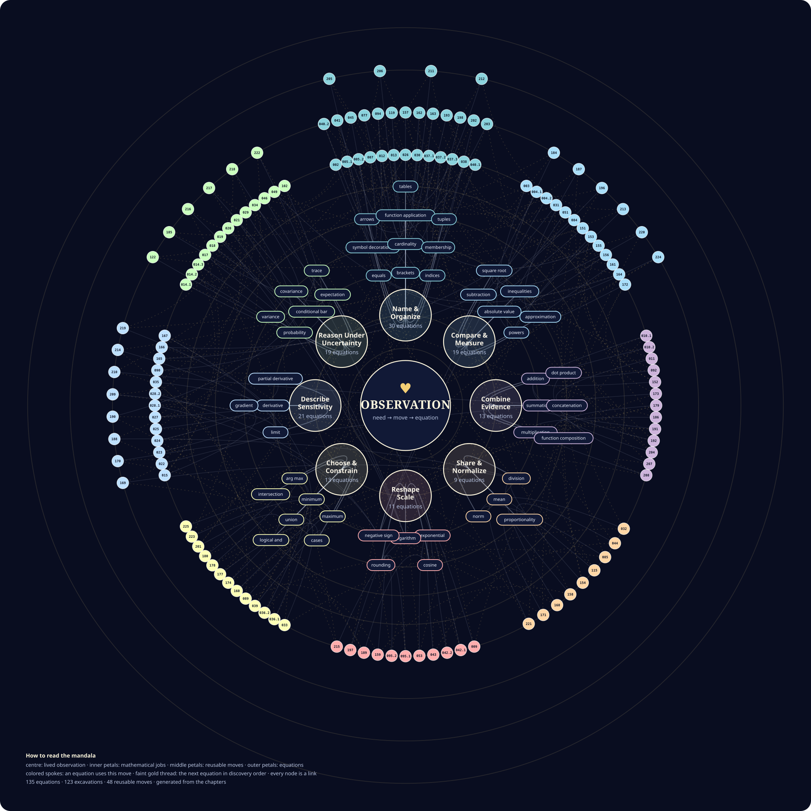

# The Living Mathematical Mandala

This is not a poster placed on top of the mathematics. It is a memory of how
the mathematics grew.

Use the Mandala only after reconstructing a chapter. The complete order is in
[How to Master AI Archaeology](../HOW_TO_MASTER_THIS_BOOK.md).

[**Open the living, clickable mandala →**](https://kleem-labs.github.io/AI-Archaeology/math-mandala/)

GitHub displays an SVG inside Markdown as one image. That preview cannot pass a
click through to an individual node. The link above opens the living mandala,
where every node has its own destination. If GitHub Pages has not finished its
first deployment, use the [direct clickable SVG](https://raw.githubusercontent.com/kleem-labs/AI-Archaeology/main/math-mandala/math-mandala.svg).

- the **heart** opens the [Mathematical Gist](../MATHEMATICAL_GIST.md), where the equations remain in discovery order;
- a **mathematical job** opens the map of [Mathematical Moves](../MATHEMATICAL_MOVES.md#map-of-the-moves);
- a **move** such as subtraction, summation, or logarithm opens its reusable mental model;
- a **numbered equation** opens the excavation in which the reader was forced to invent it.

## Read the rings from the heart outward

    observation
        ↓ creates a need
    mathematical job
        ↓ chooses a relationship-preserving move
    operation
        ↓ compresses the discovered reasoning
    equation

Equations that answer the same kind of human need stay in the same part of the
mandala, even when they were discovered many chapters apart. The faint gold
thread preserves the chronological path from one equation to the next.

- **Where does this equation belong?** Follow its color and spoke inward.
- **What did we discover next?** Follow the gold thread.

The current mandala contains **135 equations from
123 excavations**, connected through
**48 reusable mathematical moves**.

## It grows with the book

The mandala has no hand-maintained equation list. Its builder reads every
displayed equation and every Mathematical Moves link from the excavation
sources. When a future chapter earns a new equation, explain the required
operations in that chapter and link them to <code>MATHEMATICAL_MOVES.md</code>.
Then run <code>python tools/build_math_mandala.py</code>. The new equation will
enter the right conceptual neighborhood, and the next outer ring will appear
when it is needed.
